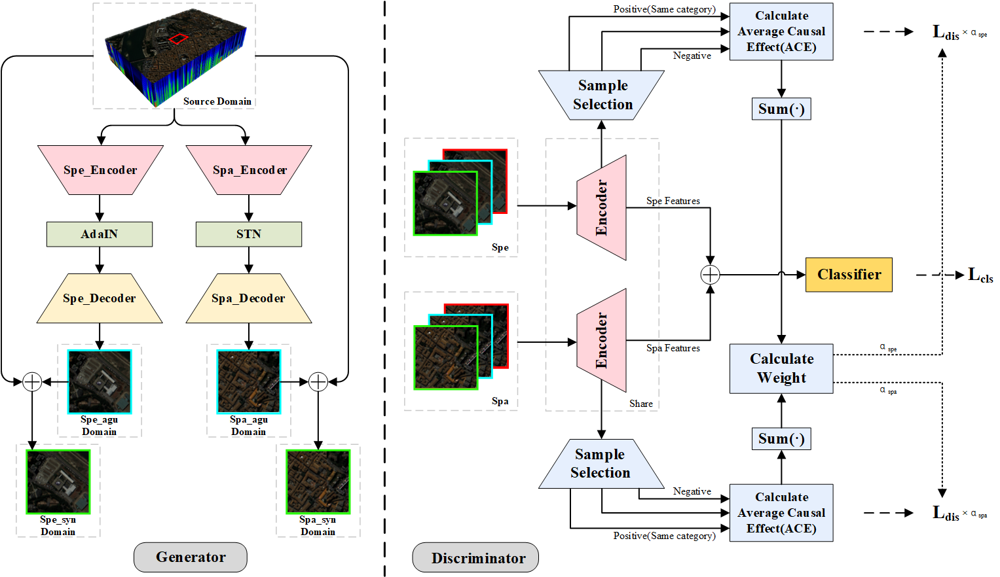

# Spectral–Spatial Enhancement and Causal Constraint for Hyperspectral Image Cross-Scene Classification

Paper web page: [Spectral–Spatial Enhancement and Causal Constraint for Hyperspectral Image Cross-Scene Classification](https://ieeexplore.ieee.org/document/10416679).

<p align='center'>
  
</p>

## Abstract

Hyperspectral cross-scene classification refers to using only labeled data from the source domain (SD) in training and testing directly on the target domain (TD) dataset. However, there are differences between the reflection spectra of objects with the same category, which makes the cross-scene classification performance drop significantly. The task of single-domain generalization (SDG) has received extensive attention to solve the above problem. To address the discrepancy between source and TDs, a spatial–spectral enhancement and causal constraint network (S2ECNet) in terms of both data enhancement and causal alignment is proposed in this article. To make up for the lack of data diversity in the SD, a generator is created in S2ECNet to simulate the spectral deviation and spatial deviation from the TD. A causal contribution discriminator is also built in S2ECNet to solve the data bias problem caused by direct feature alignment, which constructs causal contribution vectors from a causal perspective and uses contrastive learning to constrain category labels, extracting “potential” causal invariances from spectral and spatial domains. The cross-scene classification test is completed on the Pavia dataset, the HyRANK dataset, and the Houston dataset, and compared with some advanced multimodal methods. The experimental results demonstrate the effectiveness of the proposed network.

## Citation

If you find S2ECNet useful for your research or development, please cite the following:

```
@ARTICLE{10416679,
  author={Dong, Lijia and Geng, Jie and Jiang, Wen},
  journal={IEEE Transactions on Geoscience and Remote Sensing}, 
  title={Spectral–Spatial Enhancement and Causal Constraint for Hyperspectral Image Cross-Scene Classification}, 
  year={2024},
  volume={62},
  number={},
  pages={1-13},
  doi={10.1109/TGRS.2024.3360103}}

```

## Requirements

CUDA Version: 11.3

torch: 1.11.0

Python: 3.8.10

## Download Dataset

The dataset directory should look like this:

```bash
datasets
├── Houston
│   ├── Houston13.mat
│   ├── Houston13_7gt.mat
│   ├── Houston18.mat
│   └── Houston18_7gt.mat
└── Pavia
    ├── paviaC.mat
    └── paviaC_7gt.mat
    ├── paviaU.mat
    └── paviaU_7gt.mat

```

Thanks to YuxiangZhang for his contribution, You can download [Houston &amp; Pavia](https://github.com/YuxiangZhang-BIT/Data-CSHSI) dataset here.


## Run a Model:

Run the following command:

Houston dataset:
```
python main.py --data_path ./datasets/Houston/ --source_name Houston13 --target_name Houston18 --batch_size 128 --re_ratio 5 --training_sample_ratio 0.8
```
Pavia dataset:
```
python main.py --data_path ./datasets/Pavia/  --source_name paviaU --target_name paviaC --batch_size 256 --re_ratio 1 --training_sample_ratio 0.5
```

